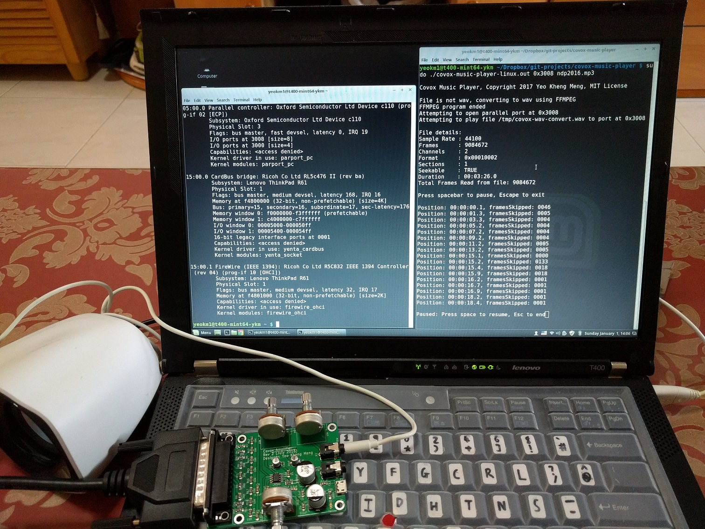

# covox-music-player

A Linux program that plays MP3 or WAV files to the [Covox Speech Thing](https://en.wikipedia.org/wiki/Covox_Speech_Thing) or its clones via a native parallel port. MP3 files are converted to WAV using FFmpeg as an intermediate step. WAV files are processed using the [libsndfile](http://www.mega-nerd.com/libsndfile/) library.

The original Covox can't be easily purchased this days but you can fabricate your own like what I have did [here](https://github.com/yeokm1/pcb-covox) and [here](https://github.com/yeokm1/pcb-covox-amp).

## Video and images

[](https://www.youtube.com/watch?v=jAaXj0RK7V8)

Video of the program in action.



Terminal on the right is my program running. Terminal on the left is to obtain the IO address of the parallel port with `lspci -v` or `cat /proc/ioports | grep parport`.


As modern computers don't have parallel ports anymore, I used this [Startech Expresscard to Parallel Port adapter](https://www.startech.com/Cards-Adapters/Parallel/1-Port-PCI-Express-Base-Parallel-ExpressCard~EC1PECPS) with my laptop. If you are on a desktop, you can use a PCI-E adapter card. I have tested this [serial-parallel combo](https://www.startech.com/Cards-Adapters/Serial-Cards-Adapters/1S1P-Native-PCI-Express-Parallel-Serial-Combo-Card-with-16950-UART~PEX1S1P952) from Startech to work although other models might work as well too.

USB-Parallel adapters are best avoided as they are not *true* parallel port hardware as they usually appear as USB printers and abstract the IO pins away. Thus you can't bitbang the pins as my program does. Besides, USB is not really suitable for realtime control due to latencies in its protocol.

## Compiling the program

The system I tested this on is Linux Mint 18 (based on Ubuntu 16.04) but it should work on other distributions as well.

```bash
sudo apt-get update

#Install dependencies
sudo apt-get install gcc libsndfile-dev ffmpeg

git clone https://github.com/yeokm1/covox-music-player.git
cd covox-music-player
gcc covox-music-player-linux.c -o covox-music-player-linux.out -Wall -lsndfile -pthread
```

## Running the program

```bash
sudo ./covox-music-player-linux.out ./linux-covox-player 0x378 file.mp3
```

Replace `0x378` with the address of your parallel port such as `0xd020` or `0x3008` which are used on my systems. The program requires root access in order to access the parallel port addresses. View the video above to see how to obtain the addresses with the commands `lspci -v` or `cat /proc/ioports | grep parport`.

## References

1. [Find Parallel Port address on Linux](http://stackoverflow.com/questions/8829820/finding-memory-address-of-a-parallel-port-on-linux)
